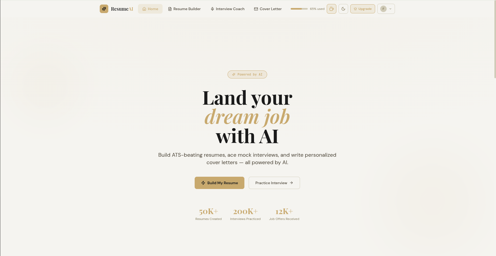

# ResumeAI — AI Resume Builder & Interview Coach



> **AI-Powered Career Toolkit**

## 🚀 Build Resumes. Ace *Interviews.*

ATS-optimized resumes in minutes.
Real-time mock interview coaching with frontier AI.
**No backend. No drama.**

---

## 🧠 Tech Stack

* ◆ Claude Sonnet
* ◆ Gemini 2.0 Flash
* ⚛️ React + Vite
* 🌐 Client-Side Only
* 📄 MIT License

---

## ✨ Features


### 📝 1. Resume Enhancement (Gemini 2.0 Flash)

Transform raw experience into compelling, impact-driven narratives.

* Impact-first bullet rewrites
* Tailored professional summary
* Highlights hidden skills
* Structured JSON output

---

### 📊 2. ATS Score Analyzer (Claude Sonnet)

Beat automated resume filters.

* Keyword matching vs job posting
* Score breakdown visualization
* Missing keyword detection
* Actionable fixes

---

### 🎤 3. Interview Engine (Claude Sonnet)

Practice with real-time AI feedback.

* 5 tailored questions/session
* Per-answer scoring
* Streaming responses
* Performance tracking

---

### 📄 4. Templates & PDF Export


* Classic · Modern · Creative · Executive
* Live A4 preview
* One-click PDF export
* Dark / Light mode

---

## ⚡ Quick Start


### 1️⃣ Clone & Install

```bash
git clone https://github.com/YOUR_USERNAME/ai-resume-builder
cd ai-resume-builder
npm install
```

---

### 2️⃣ Configure API Keys

```bash
cp .env.example .env.local
```

```env
VITE_ANTHROPIC_API_KEY=sk-ant-...
VITE_GEMINI_API_KEY=AIza...
```

---

### 3️⃣ Run Locally

```bash
npm run dev
# http://localhost:5173
```

---

### 4️⃣ Build for Production

```bash
npm run build
npm run preview
```

---

## 🔐 Environment Variables

| Variable                 | Required | Description       |
| ------------------------ | -------- -| ----------------- |
| `VITE_ANTHROPIC_API_KEY` | ✅        | Anthropic API key |
| `VITE_GEMINI_API_KEY`    | ✅        | Gemini API key    |
| `VITE_APP_URL`           | ✅        | Deployed app URL  |

⚠ **Security Note:**
These keys are exposed in the client. Restrict them to your domain:

* https://console.anthropic.com
* https://console.cloud.google.com

---

## 🚀 Deployment (Vercel)


### 🔹 Option A — One Click

Deploy via Vercel dashboard.

---

### 🔹 Option B — CLI

```bash
npm i -g vercel
vercel login
vercel --prod
```

---

### 🔹 Option C — GitHub Integration

1. Push repo to GitHub
2. Import into Vercel
3. Add environment variables
4. Click Deploy

---

## 📁 Project Structure


```bash
ai-resume-builder/
│
├── public/
│   ├── og-image.png
│   ├── favicon.svg
│   └── ...
│
├── src/
│   ├── hooks/
│   │   ├── useClaudeAPI.js
│   │   └── useGeminiAPI.js
│   │
│   ├── components/
│   │   ├── ResumeForm.jsx
│   │   ├── AIOutput.jsx
│   │   ├── ATSScorer.jsx
│   │   ├── ResumePreview.jsx
│   │   ├── TemplateChooser.jsx
│   │   └── MockInterview.jsx
│   │
│   ├── pages/
│   │   └── Builder.jsx
│   │
│   ├── resumeTemplates.js
│   ├── App.jsx
│   └── main.jsx
│
├── index.html
├── vercel.json
├── vite.config.js
├── .env.example
└── README.md
```

---

## 🔌 API Hooks

### 🧠 useClaudeAPI (Streaming)

```js
const { generate, loading, error } = useClaudeAPI()

let result = ''
await generate(systemPrompt, userMessage, chunk => {
  result += chunk
  setDisplay(result)
})
```

---

### ⚡ useGeminiAPI (JSON)

```js
const { generateJSON, loading, error } = useGeminiAPI()

const data = await generateJSON(systemPrompt, userPrompt)
// returns parsed object
```

---

## 🧰 Available Scripts

| Command           | Description      |
| ----------------- | ---------------- |
| `npm run dev`     | Start dev server |
| `npm run build`   | Build production |
| `npm run preview` | Preview build    |
| `npm run lint`    | Run ESLint       |

---

## 🌐 Browser Support

* Chrome (v90+)
* Edge (v90+)
* Firefox (v90+)
* Safari (v15+)
* Mobile Safari (iOS 15+)

---

## 📸 Add Your Screenshots

Create an `images` folder:

```bash
/images/
  hero.png
  features.png
  templates.png
  setup.png
  deploy.png
  structure.png
```

---

## ⭐ Support

If you like this project:

* ⭐ Star the repo
* 🐛 Report issues
* 💡 Request features

---

## 📄 License

MIT License — Free to use, modify, and distribute

---

## 💡 Author Note

Built with powerful AI models to simplify job preparation and maximize hiring success.
**Focus on skills. Let AI handle the rest.**
